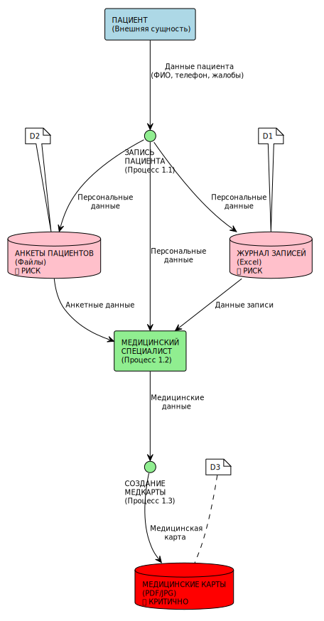
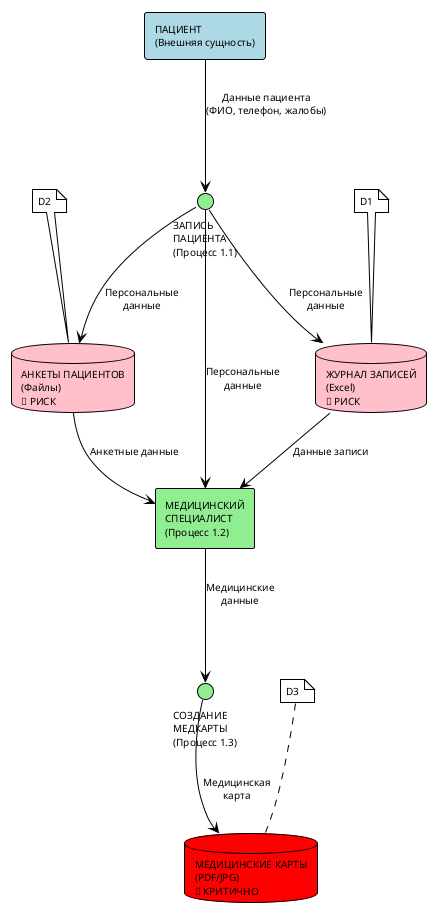
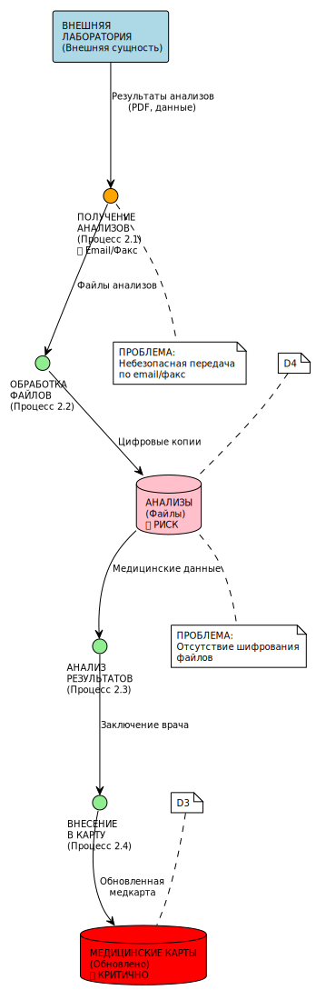
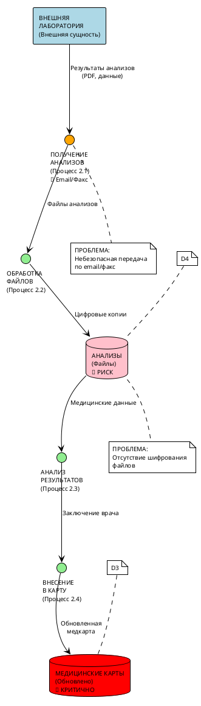
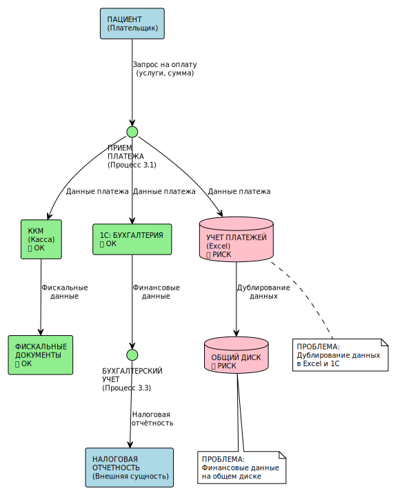
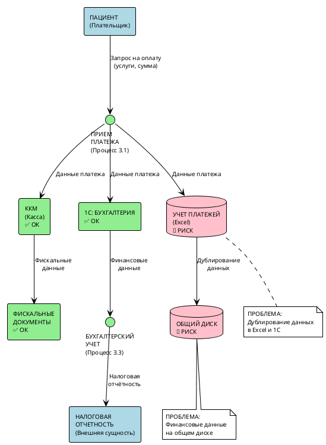
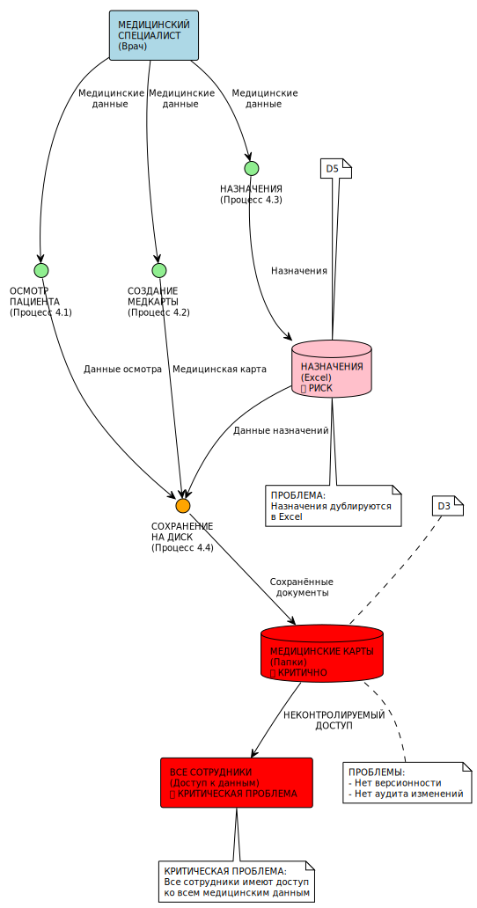
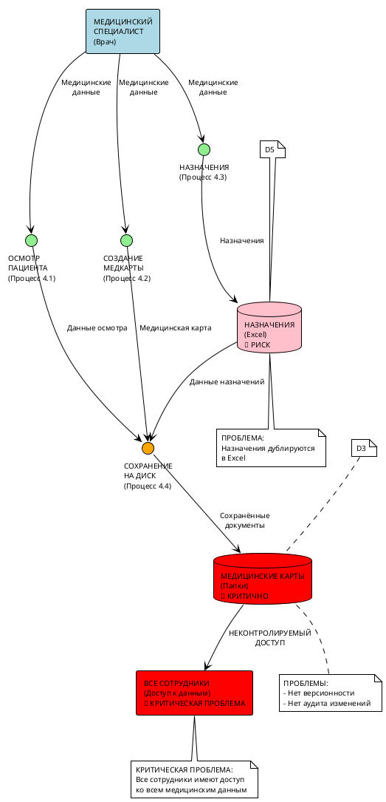
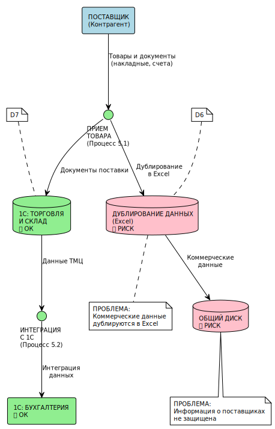
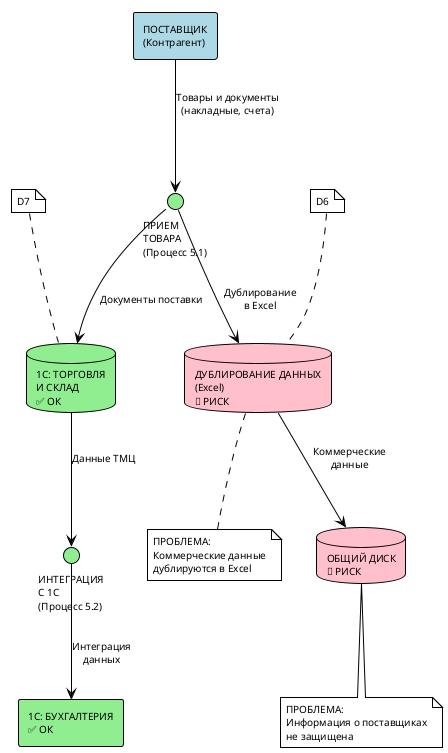

# Диаграммы потоков данных (DFD) - компания "Медикаменте"

## 1. Процесс записи пациента на приём

Код PlantUML диаграммы

**Проблемы безопасности:**
- Отсутствие шифрования данных на общем диске
- Нет контроля доступа к файлам
- Отсутствует аудит действий

---

## 2. Процесс обработки результатов анализов

Код PlantUML диаграммы

**Проблемы безопасности:**
- Небезопасная передача по email
- Результаты анализов доступны всем сотрудникам
- Нет шифрования медицинских данных

---

## 3. Процесс оплаты услуг

Код PlantUML диаграммы

**Проблемы безопасности:**
- Дублирование финансовых данных в Excel и 1С
- Отсутствие шифрования платёжной информации
- Нет контроля целостности данных

---

## 4. Процесс ведения медицинской карты

Код PlantUML диаграммы

**Проблемы безопасности:**
- Медицинские данные доступны всем сотрудникам
- Отсутствует версионность документов
- Нет аудита изменений медкарт

---

## 5. Процесс учёта ТМЦ и закупок

Код PlantUML диаграммы

**Проблемы безопасности:**
- Коммерческая информация дублируется в Excel
- Отсутствует защита данных о поставщиках
- Нет контроля доступа к финансовой информации

---

## Общие выводы по DFD:

### Критические проблемы:
1. **Общий диск как единое хранилище** - все конфиденциальные данные доступны всем
2. **Отсутствие шифрования** - данные хранятся в открытом виде
3. **Дублирование данных** - в Excel и специализированных системах
4. **Отсутствие аудита** - невозможно отследить, кто и когда обращался к данным
5. **Небезопасная передача** - email, факс без шифрования
