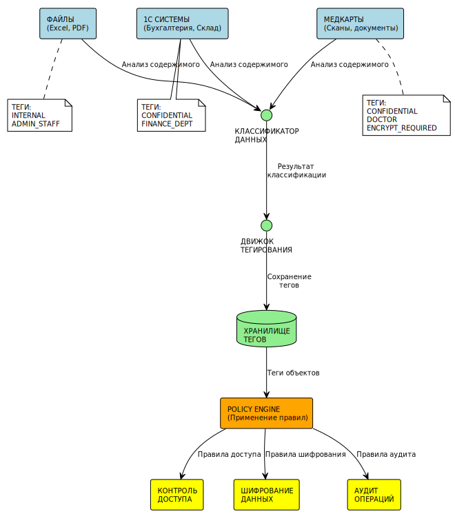
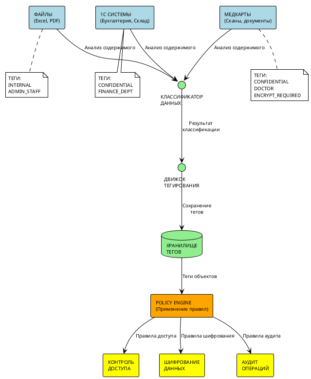

# Механизм тегирования данных - "Медикаменте"

## 1. Концепция тегирования

### Цели тегирования данных
- **Автоматизация контроля доступа** - теги определяют, кто может получить доступ к данным
- **Соблюдение нормативных требований** - автоматическая классификация по 152-ФЗ
- **Data Lineage** - отслеживание происхождения и трансформации данных
- **Автоматизация защиты** - применение мер защиты на основе тегов
- **Управление жизненным циклом** - автоматическое архивирование и удаление

Тегирование работает как штрих-коды на товарах - сразу понятно, что это за данные, кому доступны, как защищать.

---

## 2. Система тегов для "Медикаменте"

### Основные категории тегов

#### 2.1 Уровни конфиденциальности
```
PUBLIC             # Общедоступная информация (услуги, цены)
INTERNAL           # Внутренние данные (расписание, статистика)
CONFIDENTIAL       # Конфиденциальные данные (ПД, медкарты, финансы)
```

#### 2.2 Роли доступа
```
DOCTOR             # Доступ врачей
MEDICAL_STAFF      # Медицинский персонал
ADMIN_STAFF        # Административный персонал
FINANCE_DEPT       # Финансовый отдел
```

#### 2.3 Операции обработки
```
ENCRYPT_REQUIRED   # Требует шифрования
AUDIT_REQUIRED     # Требует аудита обращений
BACKUP_REQUIRED    # Требует резервного копирования
```

---

## 3. Схема применения тегов

### Примеры тегированных данных

#### Медицинская карта пациента:
```yaml
Данные: "Диагноз: Гипертония 2 степени"
Теги:
  - CONFIDENTIAL
  - DOCTOR
  - ENCRYPT_REQUIRED
```

#### Результат анализа крови:
```yaml
Данные: "Гемоглобин: 120 г/л"
Теги:
  - CONFIDENTIAL
  - MEDICAL_STAFF
  - ENCRYPT_REQUIRED
```

#### Контактные данные пациента:
```yaml
Данные: "Иванов Иван Иванович, +7(999)123-45-67"
Теги:
  - CONFIDENTIAL
  - ADMIN_STAFF
  - BACKUP_REQUIRED
```

---

## 4. Автоматизация на основе тегов

### Автоматические политики

#### 4.1 Политики доступа
```yaml
Правило_1:
  Если: CONFIDENTIAL + DOCTOR
  То: Доступ только врачам
  
Правило_2:
  Если: CONFIDENTIAL + FINANCE_DEPT
  То: Доступ только финансовому отделу
  
Правило_3:
  Если: CONFIDENTIAL
  То: Логировать все обращения к данным
```

#### 4.2 Политики защиты
```yaml
Правило_Шифрования:
  Если: ENCRYPT_REQUIRED
  То: Применить шифрование файла
  
Правило_Резервирования:
  Если: BACKUP_REQUIRED
  То: Включить в резервное копирование
```

---

## 5. Техническая реализация

### Архитектура системы тегирования



<details>
<summary>Код PlantUML диаграммы</summary>



</details>

**Принцип работы:**
1. Данные поступают из различных источников
2. Классификатор определяет тип данных  
3. Движок присваивает соответствующие теги
4. Policy Engine применяет правила безопасности на основе тегов

### Принципы хранения тегов

Теги хранятся в базе данных с привязкой к файлам и записям:
- Таблица объектов данных (файлы, записи в 1С)
- Таблица тегов (справочник возможных тегов)  
- Связь объектов с тегами
- Политики применения тегов

### Автоматическая классификация

Система автоматически определяет теги на основе содержимого:
- Медицинские документы → CONFIDENTIAL + DOCTOR + ENCRYPT_REQUIRED
- Персональные данные → CONFIDENTIAL + ADMIN_STAFF + BACKUP_REQUIRED
- Финансовые документы → CONFIDENTIAL + FINANCE_DEPT + AUDIT_REQUIRED

---

## 6. Интеграция с существующими системами

### Интеграция с 1С

Модуль тегирования для 1С:
- Автоматическое присвоение тегов новым записям
- Применение политик доступа на основе тегов

Примеры:
- Документы продаж → CONFIDENTIAL + FINANCE_DEPT
- Контрагенты → INTERNAL + ADMIN_STAFF  
- Медицинские записи → CONFIDENTIAL + DOCTOR

### Интеграция с файловой системой

Теги сохраняются в метаданных файлов:
- Автоматическое применение политик при доступе к файлу
- Индексирование для быстрого поиска
- Контроль доступа на основе тегов

Пример: файл "patient_123_xray.jpg" получает теги CONFIDENTIAL + MEDICAL_STAFF + ENCRYPT_REQUIRED

---

## 7. Мониторинг и аудит тегирования

### Метрики эффективности

Основные показатели работы системы тегирования:
- Покрытие тегирования данных
- Точность автоматической классификации  
- Время применения политик безопасности
- Количество нарушений политик

### Аудит тегирования

Система ведёт журнал всех операций с тегами:
- Кто добавил/изменил/удалил тег
- Когда была выполнена операция  
- Причина изменения тега
- К какому объекту данных применён тег

Это позволяет отследить все изменения в классификации данных и обеспечить подотчётность.

---

## 8. Ожидаемые результаты

### Результаты внедрения тегирования

- Автоматизация контроля доступа к данным
- Соблюдение требований 152-ФЗ
- Прозрачность работы с конфиденциальными данными
- Готовность системы к масштабированию

