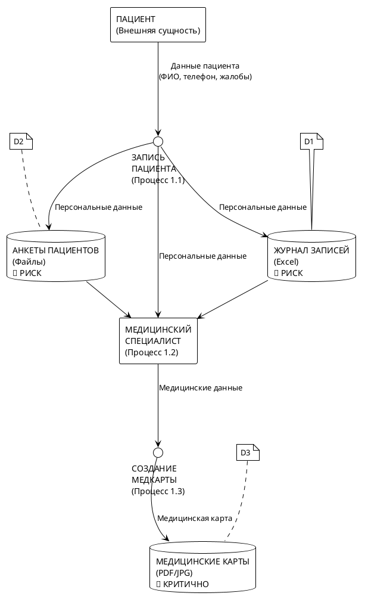
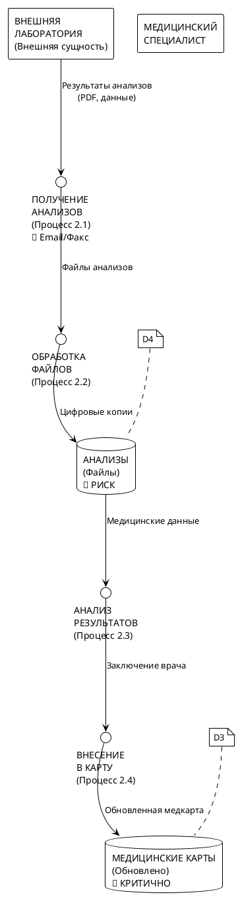
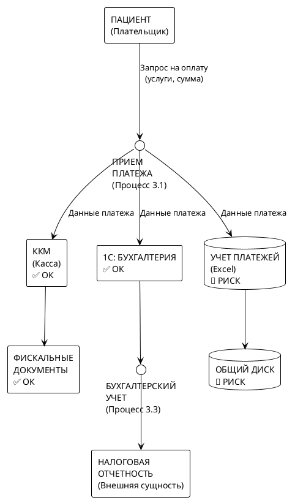
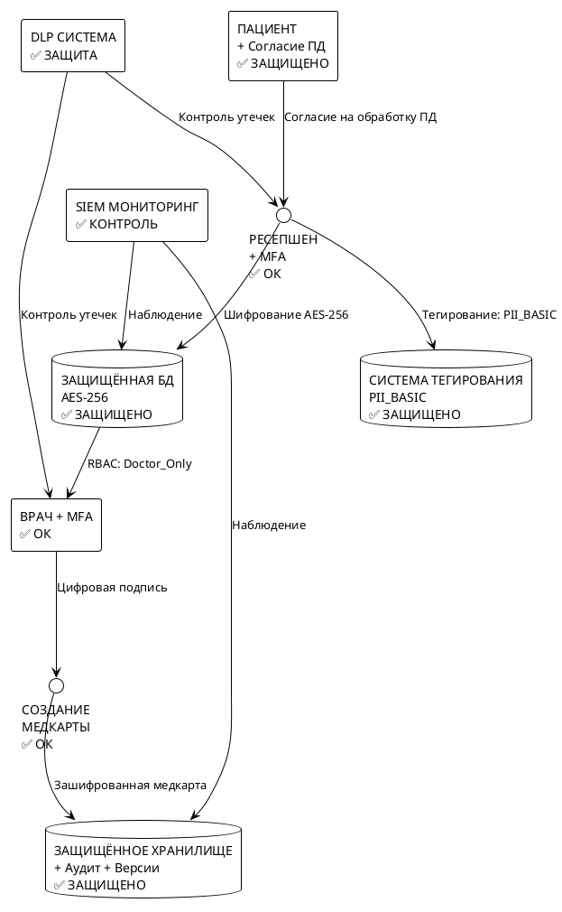

# DFD диаграммы в формате PlantUML - "Медикаменте"

**Уровень DFD:** Level 1-2 (детализация основных процессов без углубления в подпроцессы)  
**Назначение:** Визуализация потоков конфиденциальных данных для выявления уязвимостей безопасности

Этот файл содержит диаграммы потоков данных в формате PlantUML для конвертации в SVG.

## 1. Процесс записи пациента на приём



## 2. Процесс обработки результатов анализов



## 3. Процесс оплаты услуг



## 4. Защищённый процесс записи пациента (улучшенная версия)



## Инструкция по конвертации в SVG

Для конвертации PlantUML диаграмм в SVG используйте:

### Онлайн:
1. Откройте http://www.plantuml.com/plantuml/uml/
2. Вставьте код диаграммы
3. Получите SVG-файл

### Локально:
```bash
# Установка PlantUML
brew install plantuml  # macOS
sudo apt install plantuml  # Ubuntu

# Конвертация в SVG
plantuml -tsvg dfd_plantuml.md
```

### VS Code:
1. Установите расширение "PlantUML"
2. Откройте файл с диаграммами
3. Используйте Ctrl+Shift+P → "PlantUML: Preview Current Diagram"

## Преимущества PlantUML диаграмм:
- ✅ Векторная графика (SVG)
- ✅ Масштабируемость
- ✅ Профессиональный вид
- ✅ Автоматическая компоновка
- ✅ Интеграция с документацией
- ✅ Версионирование в Git

