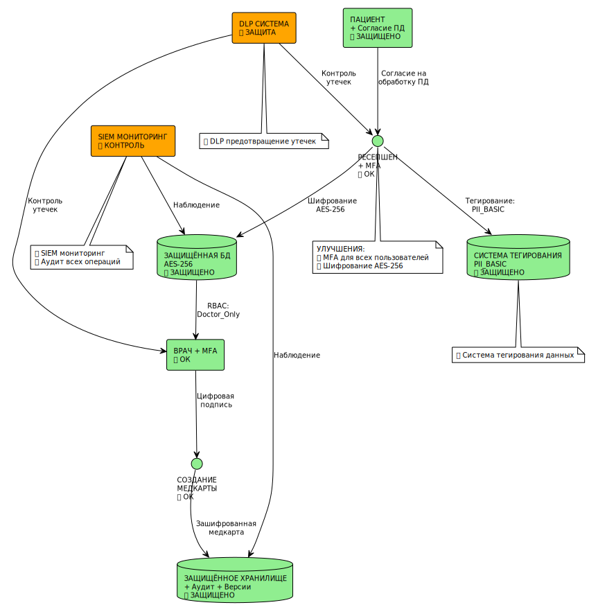
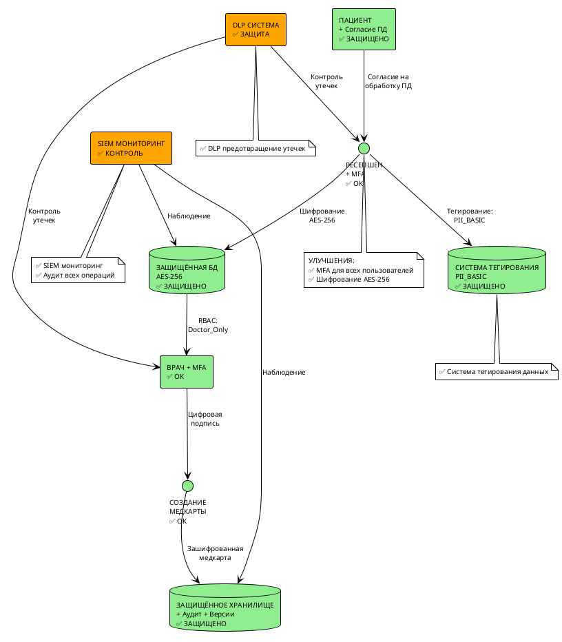
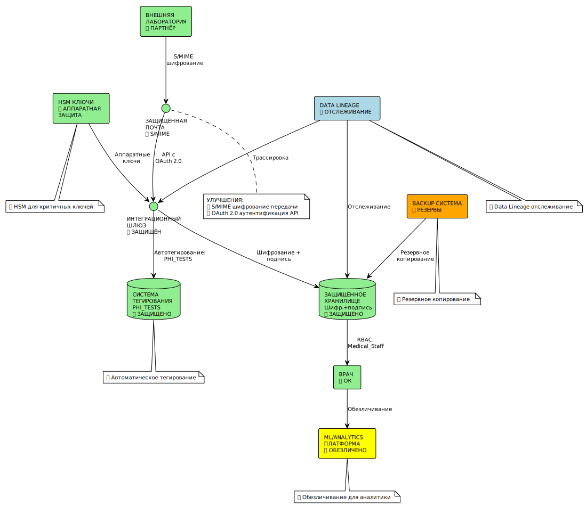
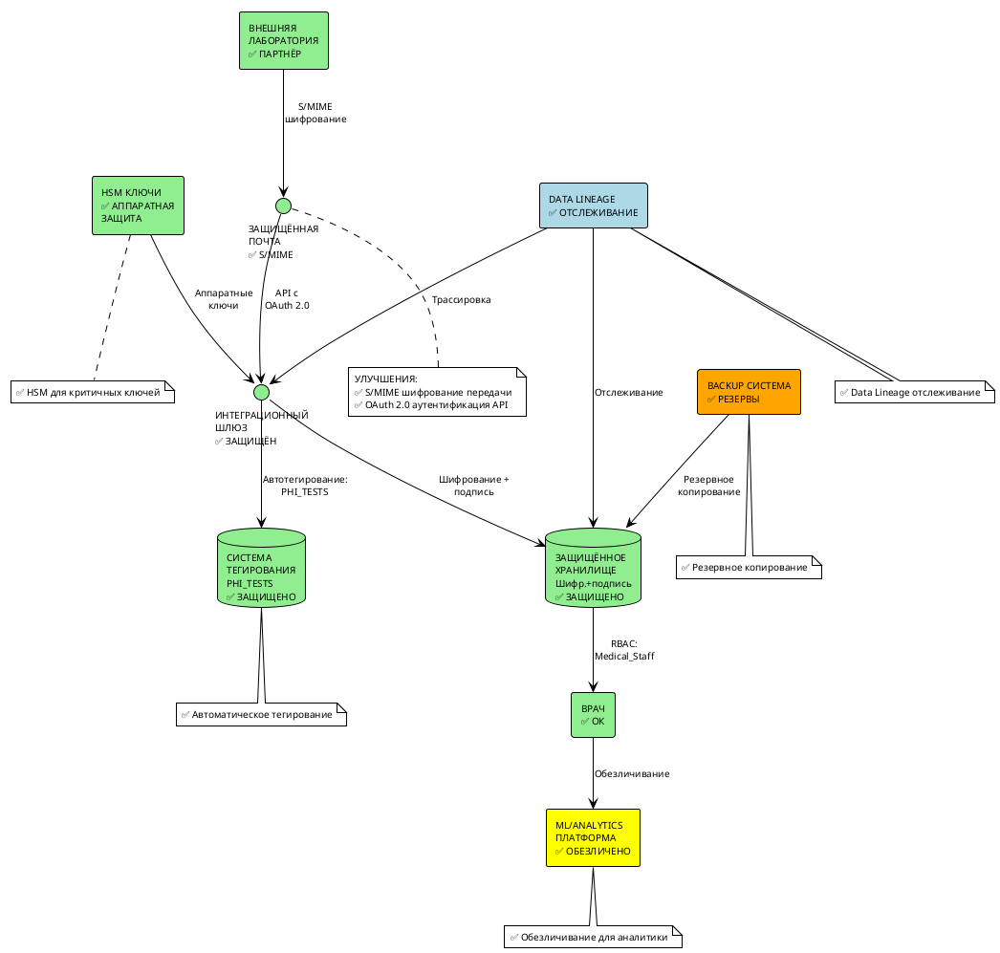

# Инструменты и меры для обеспечения конфиденциальности - "Медикаменте"

## 1. Комплексная схема защиты данных

### Обновлённые диаграммы потоков данных с мерами защиты

#### 1.1 Защищённый процесс записи пациента



<details>
<summary>Код PlantUML диаграммы</summary>



</details>

#### 1.2 Защищённый процесс обработки анализов



<details>
<summary>Код PlantUML диаграммы</summary>



</details>

---

## 2. Инструменты по категориям

### 2.1 Шифрование и криптография

| Инструмент | Назначение | Применение в "Медикаменте" | Стоимость | Приоритет |
|------------|------------|---------------------------|-----------|-----------|
| **BitLocker** | Полнодисковое шифрование | Все ПК и серверы | Включено в Windows | Критический |
| **VeraCrypt** | Шифрование файлов и контейнеров | Медицинские документы | Бесплатно | Критический |
| **Windows BitLocker** | Шифрование дисков | Все рабочие станции и серверы | Включено в Windows | Критический |
| **7-Zip с паролем** | Шифрование архивов | Медицинские документы для передачи | Бесплатно | Высокий |
| **S/MIME в Outlook** | Шифрование email | Защищённая переписка с лабораториями | Включено в Office | Средний |

### 2.2 Контроль доступа и аутентификация

| Инструмент | Назначение | Применение в "Медикаменте" | Стоимость | Приоритет |
|------------|------------|---------------------------|-----------|-----------|
| **Microsoft Active Directory** | Централизованная аутентификация | Базовая система доступа | $6/пользователь/месяц | Критический |
| **Azure AD Premium** | Расширенное управление доступом | MFA, условный доступ | $6-22/пользователь/месяц | Критический |
| **Keycloak** | Open Source IAM | Альтернатива Azure AD | Бесплатно | Высокий |
| **CyberArk** | Управление привилегированными учётками | Администраторские доступы | $30,000+/год | Средний |
| **Duo Security** | Двухфакторная аутентификация | MFA для всех сотрудников | $3/пользователь/месяц | Критический |
| **YubiKey** | Аппаратные токены | Физическая 2FA | $50/токен | Средний |

### 2.3 Мониторинг и аудит

| Инструмент | Назначение | Применение в "Медикаменте" | Стоимость | Приоритет |
|------------|------------|---------------------------|-----------|-----------|
| **Windows Event Log** | Журналирование событий | Отслеживание доступа к файлам | Включено в Windows | Высокий |
| **Elastic Security** | Централизованные логи | Сбор логов с серверов и ПК | Бесплатная версия | Средний |
| **Varonis** | Анализ поведения пользователей | Обнаружение аномалий доступа | $50,000+/год | Средний |
| **Netwrix Auditor** | Аудит изменений в системах | Отслеживание изменений в 1С, AD | $1,500/сервер/год | Средний |
| **OSSEC** | Host-based IDS | Мониторинг серверов | Бесплатно | Низкий |

### 2.4 Предотвращение утечек данных (DLP)

| Инструмент | Назначение | Применение в "Медикаменте" | Стоимость | Приоритет |
|------------|------------|---------------------------|-----------|-----------|
| **Microsoft Purview** | DLP для Office 365 | Контроль утечек через email | $2-10/пользователь/месяц | Высокий |
| **Symantec DLP** | Комплексная DLP система | Полный контроль утечек | $50-100/пользователь/год | Высокий |
| **Forcepoint DLP** | Защита от утечек данных | Контроль всех каналов | $40-80/пользователь/год | Высокий |
| **Digital Guardian** | Endpoint DLP | Защита рабочих станций | $30-60/устройство/год | Средний |
| **CoSoSys Endpoint Protector** | USB и email контроль | Базовая защита от утечек | $25/устройство/год | Средний |

### 2.5 Резервное копирование и восстановление

| Инструмент | Назначение | Применение в "Медикаменте" | Стоимость | Приоритет |
|------------|------------|---------------------------|-----------|-----------|
| **Veeam Backup** | Резервное копирование | Backup серверов и БД | $400-800/сокет | Критический |
| **Acronis Cyber Backup** | Backup с защитой от ransomware | Защищённые бэкапы | $69-179/рабочее место | Критический |
| **Azure Backup** | Облачное резервирование | Offsite backup | $0.10/ГБ/месяц | Высокий |
| **Commvault** | Enterprise backup решение | Для больших объёмов данных | $50,000+/год | Низкий |
| **Duplicati** | Open Source backup | Бюджетное решение | Бесплатно | Средний |

---

## 3. Специализированные медицинские решения

### 3.1 Медицинские информационные системы

| Решение | Назначение | Преимущества | Соответствие |
|---------|------------|--------------|--------------|
| **МИС ДОКА+** | Российская МИС | Соответствие 152-ФЗ, интеграция с 1С | 152-ФЗ, Приказ 911н |
| **Медиалог** | Облачная МИС | Быстрое внедрение, SaaS модель | 152-ФЗ |
| **БАРС.Здравоохранение** | Комплексная МИС | Полная автоматизация | Все российские стандарты |
| **Интерин** | МИС для частных клиник | Специализация на частной медицине | 152-ФЗ |

### 3.2 Интеграция с лабораториями

| Решение | Назначение | Безопасность |
|---------|------------|--------------|
| **HL7 FHIR** | Стандарт обмена медданными | Встроенное шифрование |
| **ЛИМС Лаборатория** | Российская ЛИМС | Соответствие требованиям |
| **Roche CobasLink** | Интеграция с анализаторами | Защищённые протоколы |

---

## 4. Архитектура безопасности


### 4.2 Рекомендуемая архитектура для "Медикаменте"

```yaml
Сетевая_Архитектура:
  DMZ:
    - Web-портал для пациентов
    - API Gateway
    - Load Balancer
  
  Internal_Network:
    - Серверы приложений
    - База данных
    - Файловое хранилище
  
  Management_Network:
    - SIEM система
    - Backup серверы
    - Мониторинг

Защитные_Компоненты:
  Периметр:
    - Fortinet FortiGate (Next-Gen Firewall)
    - Suricata (IDS/IPS)
    - ModSecurity (WAF)
  
  Внутренняя_сеть:
    - Microsoft Defender for Endpoint
    - CrowdStrike Falcon (EDR)
    - Cisco ISE (Network Access Control)
  
  Данные:
    - BitLocker (диски)
    - TDE для SQL Server
    - Azure Information Protection
```

---

