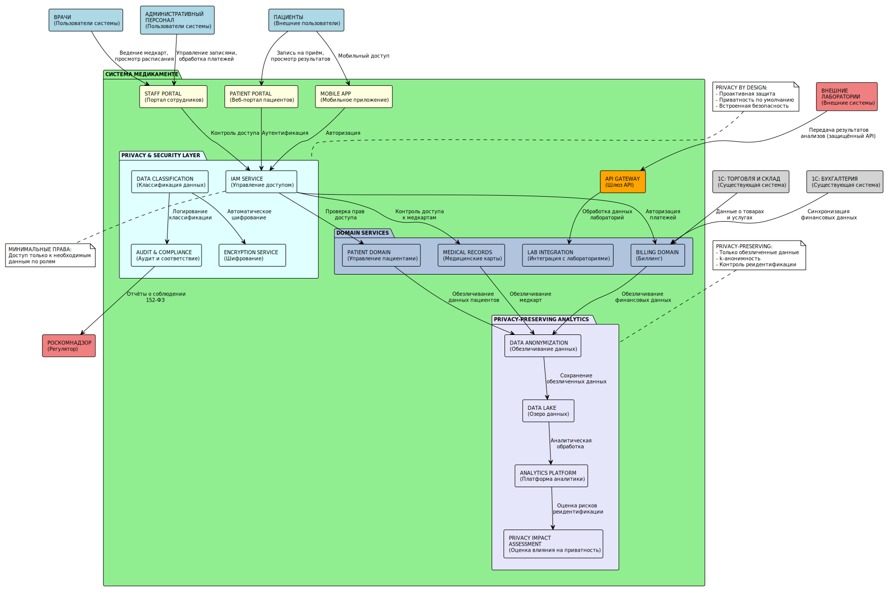

# Диаграмма контекста C4 целевого состояния - "Медикаменте"

## Целевая архитектура системы с Privacy by Design

Код PlantUML диаграммы

## Описание архитектуры

### Ключевые принципы Privacy by Design в архитектуре:

**1. Проактивная защита**
- Слой безопасности (Privacy & Security Layer) встроен в архитектуру
- Автоматическая классификация и шифрование данных

**2. Приватность по умолчанию**  
- IAM Service обеспечивает минимальные права доступа
- Данные закрыты по умолчанию, открываются только по необходимости

**3. Встроенная приватность**
- Каждый доменный сервис интегрирован со слоем безопасности
- Обезличивание данных происходит автоматически при передаче в аналитику

**4. Полная функциональность**
- Система обеспечивает все бизнес-требования
- Удобство использования не страдает от мер безопасности

**5. Сквозная безопасность**
- Защита на всех уровнях: от пользовательского интерфейса до хранения данных
- Шифрование, аудит и контроль доступа на каждом этапе

**6. Видимость и прозрачность**
- Audit & Compliance Service обеспечивает полную прозрачность
- Пациенты могут видеть, кто обращался к их данным

**7. Уважение к приватности**
- Пациент контролирует свои данные через Patient Portal
- Возможность отзыва согласий и удаления данных

### Новые блоки для обеспечения Privacy by Design:

1. **Privacy & Security Layer** - централизованный слой безопасности
2. **Data Classification Service** - автоматическая классификация данных
3. **Privacy-Preserving Analytics** - аналитика с сохранением приватности
4. **API Gateway** - контролируемый доступ к данным
5. **Privacy Impact Assessment** - оценка влияния на приватность
