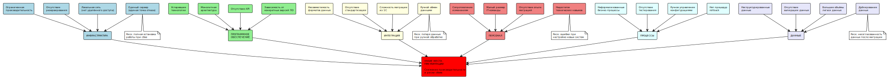

# Диаграмма Исикавы - анализ узких мест миграции

## Диаграмма "Рыбья кость" для выявления узких мест при миграции

```plantuml
@startuml ishikawa_migration_bottlenecks
!theme plain
skinparam backgroundColor white
skinparam defaultFontSize 9

' Основная проблема (голова рыбы)
rectangle "УЗКИЕ МЕСТА\nПРИ МИГРАЦИИ\n\nСнижение производительности\nи риски сбоев" as main_problem #red

' Основные категории (кости)
rectangle "ИНФРАСТРУКТУРА" as infrastructure #lightblue
rectangle "ПРОГРАММНОЕ\nОБЕСПЕЧЕНИЕ" as software #lightgreen  
rectangle "ИНТЕГРАЦИЯ" as integration #lightyellow
rectangle "ПЕРСОНАЛ" as personnel #lightcoral
rectangle "ПРОЦЕССЫ" as processes #lightcyan
rectangle "ДАННЫЕ" as data #lavender

' Проблемы инфраструктуры
rectangle "Единый сервер\n(единая точка отказа)" as single_server #lightblue
rectangle "Ограниченная\nпроизводительность" as limited_performance #lightblue
rectangle "Отсутствие\nрезервирования" as no_backup #lightblue
rectangle "Локальная сеть\n(нет удалённого доступа)" as local_network #lightblue

' Проблемы ПО
rectangle "Устаревшие\nтехнологии" as old_tech #lightgreen
rectangle "Монолитная\nархитектура" as monolith #lightgreen
rectangle "Отсутствие API" as no_api #lightgreen
rectangle "Зависимость от\nконкретных версий ПО" as software_deps #lightgreen

' Проблемы интеграции
rectangle "Ручной обмен\nданными" as manual_exchange #lightyellow
rectangle "Несовместимость\nформатов данных" as format_incompatibility #lightyellow
rectangle "Отсутствие\nстандартизации" as no_standards #lightyellow
rectangle "Сложность миграции\nиз 1С" as onec_migration #lightyellow

' Проблемы персонала
rectangle "Недостаток\nтехнических навыков" as skill_gap #lightcoral
rectangle "Сопротивление\nизменениям" as change_resistance #lightcoral
rectangle "Малый размер\nIT-команды" as small_team #lightcoral
rectangle "Отсутствие опыта\nмиграций" as no_migration_exp #lightcoral

' Проблемы процессов
rectangle "Неформализованные\nбизнес-процессы" as informal_processes #lightcyan
rectangle "Отсутствие\nтестирования" as no_testing #lightcyan
rectangle "Ручное управление\nконфигурациями" as manual_config #lightcyan
rectangle "Нет процедур\nrollback" as no_rollback #lightcyan

' Проблемы данных
rectangle "Дублирование\nданных" as data_duplication #lavender
rectangle "Неструктурированные\nданные" as unstructured_data #lavender
rectangle "Отсутствие\nвалидации данных" as no_validation #lavender
rectangle "Большие объёмы\nлегаси данных" as legacy_data #lavender

' Связи с основной проблемой
infrastructure --> main_problem
software --> main_problem
integration --> main_problem
personnel --> main_problem
processes --> main_problem
data --> main_problem

' Связи проблем с категориями
single_server --> infrastructure
limited_performance --> infrastructure
no_backup --> infrastructure
local_network --> infrastructure

old_tech --> software
monolith --> software
no_api --> software
software_deps --> software

manual_exchange --> integration
format_incompatibility --> integration
no_standards --> integration
onec_migration --> integration

skill_gap --> personnel
change_resistance --> personnel
small_team --> personnel
no_migration_exp --> personnel

informal_processes --> processes
no_testing --> processes
manual_config --> processes
no_rollback --> processes

data_duplication --> data
unstructured_data --> data
no_validation --> data
legacy_data --> data

' Дополнительные детали
note bottom of single_server : Риск: полная остановка\nработы при сбое
note bottom of skill_gap : Риск: ошибки при\nнастройке новых систем
note bottom of data_duplication : Риск: несогласованность\nданных после миграции
note bottom of manual_exchange : Риск: потеря данных\nпри ручной обработке

@enduml
```

Код PlantUML диаграммы

## Анализ категорий узких мест

### 1. Инфраструктура (критический риск)
**Основные проблемы:**
- Единый сервер как единая точка отказа
- Ограниченная производительность для 5-кратного роста
- Отсутствие резервирования и отказоустойчивости
- Локальная сеть не поддерживает удалённую работу

**Влияние на миграцию:**
- Невозможность плавного перехода без простоев
- Риск полной потери работоспособности при сбое
- Ограничения по масштабированию новой системы

### 2. Программное обеспечение (высокий риск)
**Основные проблемы:**
- Устаревшие технологии и монолитная архитектура
- Отсутствие API для интеграций
- Зависимость от конкретных версий ПО

**Влияние на миграцию:**
- Сложность декомпозиции монолита на микросервисы
- Необходимость полной переработки интеграций
- Риски совместимости при обновлении ПО

### 3. Интеграция (высокий риск)
**Основные проблемы:**
- Ручной обмен данными с партнёрами
- Несовместимость форматов данных
- Сложность миграции данных из 1С

**Влияние на миграцию:**
- Риск потери данных при автоматизации процессов
- Сложность обеспечения совместимости со старыми системами
- Необходимость синхронизации данных во время перехода

### 4. Персонал (средний риск)
**Основные проблемы:**
- Недостаток технических навыков для новых технологий
- Сопротивление изменениям привычных процессов
- Малый размер IT-команды для масштабной миграции

**Влияние на миграцию:**
- Увеличение времени адаптации к новой системе
- Возможные ошибки из-за неопытности персонала
- Необходимость внешней помощи и обучения

### 5. Процессы (средний риск)
**Основные проблемы:**
- Неформализованные бизнес-процессы
- Отсутствие процедур тестирования и rollback
- Ручное управление конфигурациями

**Влияние на миграцию:**
- Сложность автоматизации неописанных процессов
- Риски при откате к старой системе
- Возможные ошибки конфигурации

### 6. Данные (высокий риск)
**Основные проблемы:**
- Дублирование и неструктурированность данных
- Отсутствие валидации данных
- Большие объёмы легаси данных

**Влияние на миграцию:**
- Сложность и длительность миграции данных
- Риск потери или искажения информации
- Необходимость очистки и структурирования данных
